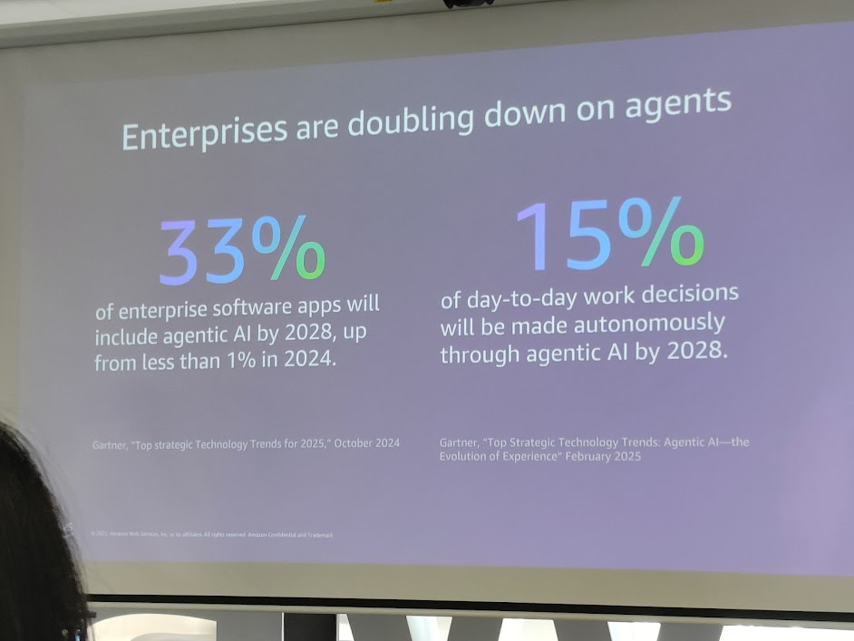

## 1. Opening Theme: Agentic AI

Jun Kai Loke sets up the afternoon with the focus on **Agentic AI** - the next generation of artificial intelligence that goes beyond standalone generative models.
Goal: illustrate the **evolutionary journey** from assistive AI -> AI agents -> fully autonomous multi-agent systems.


---

## 2. The Evolution into Agentic AI

* **Generative AI Assistants**

  * Follow rules and automate repetitive tasks.
  * Require significant human oversight.

* **Generative AI Agents**

  * Chase a single goal.
  * Tackle a wider range of tasks.
  * Automate entire workflows end-to-end.

* **Agentic AI Systems**

  * Fully autonomous operation.
  * Multi-agent architectures.
  * Emulate human thinking and reasoning.

```cli
+------------------------+
| Generative AI Assistant|
| - Automate tasks       |
| - Rule-based           |
+-----------+------------+
            |
            v
+-----------+------------+
| Generative AI Agent    |
| - Singular goal        |
| - Automate workflows   |
+-----------+------------+
            |
            v
+-----------+------------+
| Agentic AI System      |
| - Multi-agent          |
| - Fully autonomous     |
| - Human-like reasoning |
+------------------------+
```

-> Core trajectory: **higher automation + lower human supervision -> bigger business impact**.

---

## 3. Enterprise Trends: Doubling Down on Agents

* According to Gartner (2024-2025):

  * **33%** of enterprise software apps will embed Agentic AI by 2028 (up from <1% in 2024).
  * **15%** of daily work decisions will be made **autonomously** by Agentic AI by 2028.



```cli
2024    <1%  enterprise apps using Agentic AI
2028    33% enterprise apps using Agentic AI

2028    15% daily decisions -> automated by Agentic AI
```

---

## 4. Vietnam Data & AI Success Stories

Jun Kai Loke highlighted **successful Vietnamese case studies**:

* **Katalon**: Agentic quality assurance -> Intelligent agents powering automation testing.
* **Apero**: AI adoption with NVIDIA GPUs -> Scaled to **50M downloads**.
* **TechcomSecurities**: Market and investment agents -> Multi-agent analysis in production.


```cli
+-----------------+    +----------------+    +---------------------+
|  Katalon        |    |   Apero        |    | TechcomSecurities   |
| QA Agents       |    | AI + NVIDIA    |    | Multi-agent Market  |
| Automation Test |    | 50M downloads  |    | Investment Analysis |
+-----------------+    +----------------+    +---------------------+
```

---

## 5. Key Insights for the Notion materials

* **Agentic AI = the next frontier**: not just generating content, but **making decisions and taking action**.
* **Vietnam is a showcase**: companies spanning QA, gaming, and fintech already run agents in production.
* **2028 is the breakout inflection**: agentic AI will permeate enterprise software and day-to-day decisioning.

-> Hence CloudDay 2025 keeps **AI agents** as the backbone for the entire afternoon track.
