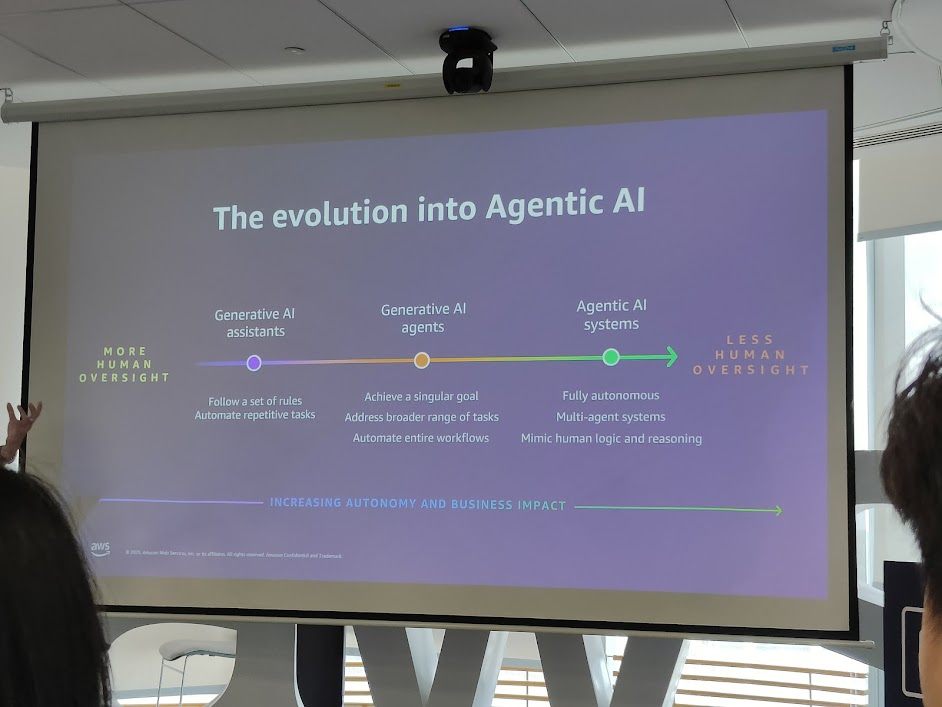

## 1. Chủ đề mở màn: Agentic AI

Jun Kai Loke đặt nền móng cho toàn bộ buổi chiều với chủ đề **Agentic AI** – thế hệ tiếp theo của trí tuệ nhân tạo, đi xa hơn so với Generative AI đơn thuần.
Mục tiêu: minh họa **hành trình tiến hóa** từ AI hỗ trợ → AI agent → hệ thống AI đa agent hoàn toàn tự động.


---

## 2. The Evolution into Agentic AI

* **Generative AI Assistants**

  * Làm theo quy tắc, tự động hóa các tác vụ lặp lại.
  * Cần nhiều giám sát từ con người.

* **Generative AI Agents**

  * Đạt mục tiêu đơn lẻ.
  * Giải quyết nhiều loại nhiệm vụ hơn.
  * Tự động hóa toàn bộ workflow.

* **Agentic AI Systems**

  * Hoàn toàn tự động.
  * Hệ thống đa agent.
  * Bắt chước tư duy & lý luận của con người.

```cli
+------------------------+
| Generative AI Assistant|
| - Automate tasks       |
| - Rule-based           |
+-----------+------------+
            |
            v
+-----------+------------+
| Generative AI Agent    |
| - Singular goal        |
| - Automate workflows   |
+-----------+------------+
            |
            v
+-----------+------------+
| Agentic AI System      |
| - Multi-agent          |
| - Fully autonomous     |
| - Human-like reasoning |
+------------------------+
```

👉 Trục chính: **tăng dần mức độ tự động + giảm giám sát con người → tăng tác động business**.

---

## 3. Xu hướng Doanh nghiệp: Doubling Down on Agents

* Theo Gartner (2024–2025):

  * **33%** ứng dụng phần mềm doanh nghiệp sẽ tích hợp Agentic AI vào năm 2028 (từ <1% năm 2024).
  * **15%** quyết định công việc hàng ngày sẽ được đưa ra **tự động** bởi Agentic AI vào năm 2028.


```cli
2024    <1%  enterprise apps dùng Agentic AI
2028    33% enterprise apps dùng Agentic AI

2028    15% decisions hàng ngày → tự động bởi Agentic AI
```

---

## 4. Vietnam Data & AI Success Stories

Jun Kai Loke cũng nhấn mạnh vào các **case study thành công ở Việt Nam**:

* **Katalon**: Agentic Quality Assurance → Automation testing với Intelligent Agents.
* **Apero**: AI Adoption với NVIDIA GPUs → Scale đến **50M downloads**.
* **TechcomSecurities**: Market & Investment Agents → Multi-agent analysis in action.


```cli
+-----------------+    +----------------+    +---------------------+
|  Katalon        |    |   Apero        |    | TechcomSecurities   |
| QA Agents       |    | AI + NVIDIA    |    | Multi-agent Market  |
| Automation Test |    | 50M downloads  |    | Investment Analysis |
+-----------------+    +----------------+    +---------------------+
```

---

## 5. Insight chính cho học liệu Notion

* **Agentic AI = cấp tiến mới**: không chỉ tạo nội dung, mà còn **ra quyết định & hành động**.
* **Việt Nam là điển hình**: các công ty từ QA, gaming, fintech đều đã triển khai agent.
* **2028 sẽ là mốc bùng nổ**: khi agentic AI thâm nhập sâu vào phần mềm doanh nghiệp và quyết định hằng ngày.

👉 Đây là lý do tại sao CloudDay 2025 nhấn mạnh **AI Agents** như một “trục chính” xuyên suốt toàn bộ track buổi chiều.
