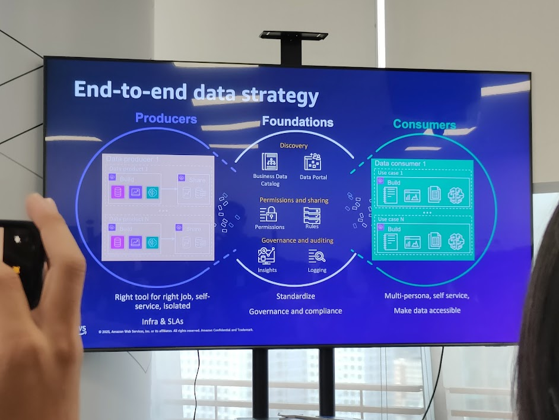
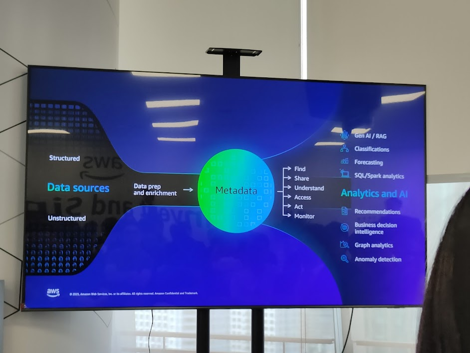
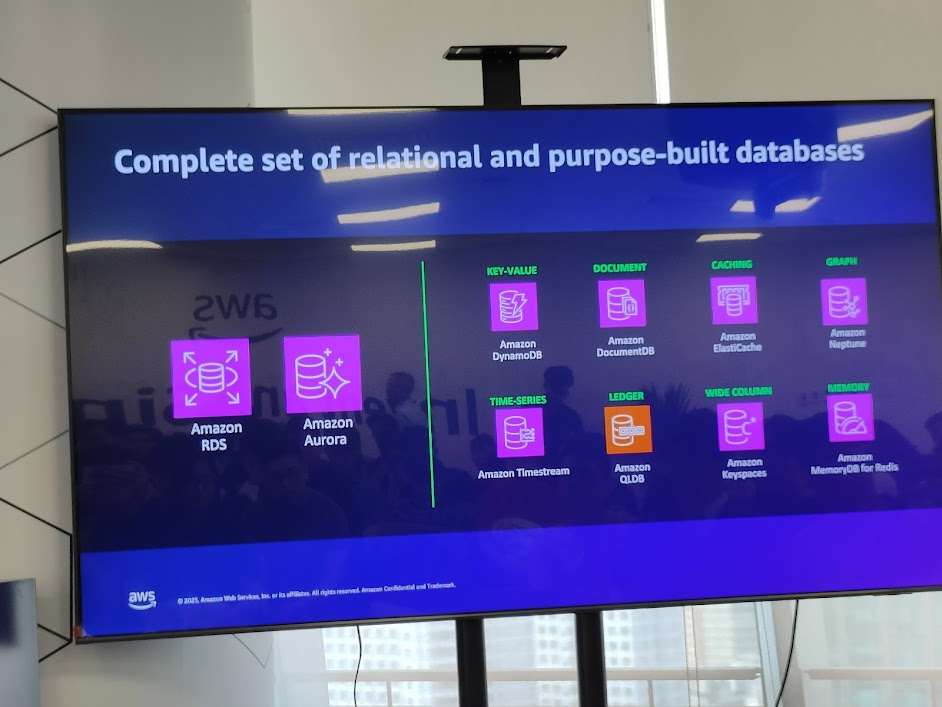
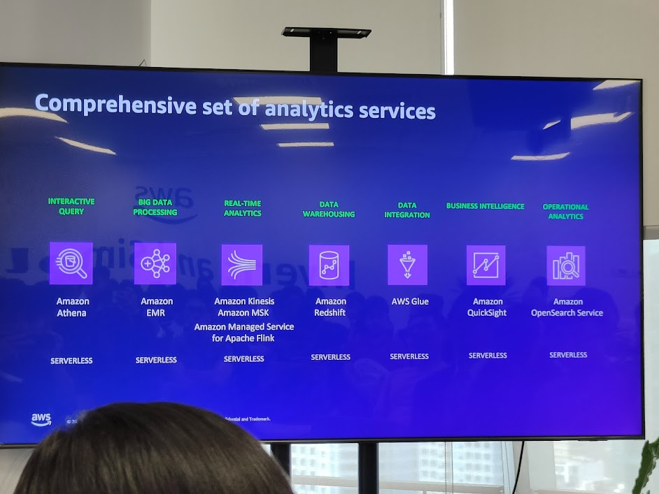

## 1. Thách thức từ Data Silos


Doanh nghiệp thường gặp rào cản khi khai thác dữ liệu vì dữ liệu bị **chia cắt thành nhiều silo**:

* **Data silos**: Data Lake, Data Warehouse tồn tại độc lập, khó kết hợp.
* **People silos**: dữ liệu nằm ở các bộ phận khác nhau, thiếu sự cộng tác.
* **Business silos**: bị hạn chế bởi compliance, chi phí, mô hình quản trị.

👉 Điều này làm insight bị phân tán, giảm tốc độ đổi mới và kìm hãm ứng dụng AI.

```cli
Data Lake + DW   →   Data silo
Data Owners      →   People silo
Compliance/Cost  →   Business silo
```

---

## 2. Evolution of Data Requirements


### Truyền thống (Traditional)

* Chủ yếu làm việc với **structured & semi-structured data**.
* Xử lý theo kiểu **batch pipelines**.
* Lưu trữ trong **operational & analytical stores**.
* Governance tập trung ở mức **tables, files, dashboards**.

### Hiện đại (Modern)

* **Augment structured data** bằng unstructured data (docs, media, knowledge).
* **Vector databases** trở thành thành phần cốt lõi cho AI.
* **Self-service governance**: áp dụng chính sách cho cả AI prompts/responses.
* **Stream-first pipelines** thay thế batch truyền thống để đáp ứng real-time AI/analytics.

```cli
Traditional --> Structured data, batch, centralized governance
Modern     --> Vector DB, unstructured + structured, stream-first
```

👉 Dữ liệu ngày nay cần **linh hoạt, đa dạng** và **AI-ready**.

---

## 3. End-to-End Data Strategy



Một **chiến lược dữ liệu end-to-end** bao gồm:

* **Producers**: tạo & chia sẻ data, dùng đúng công cụ cho đúng việc, self-service.
* **Foundations**: tiêu chuẩn hóa governance, auditing, discovery, permissions.
* **Consumers**: multi-persona, self-service, dữ liệu dễ truy cập cho nhiều use-case khác nhau.

👉 Tư duy chuyển từ *hạ tầng đơn lẻ* → *nền tảng chia sẻ đồng nhất*.

```cli
[ Producers ] --> [ Foundations ] --> [ Consumers ]
Build/Share     Catalog/Govern     Use cases, BI, AI
```

---

## 4. Metadata làm trung tâm


Khi metadata trở thành **trung tâm hệ sinh thái dữ liệu**:

* **Nguồn dữ liệu (structured + unstructured)** → được chuẩn hóa & enrich.
* Metadata cung cấp: Find, Share, Understand, Access, Act, Monitor.
* Từ đó kích hoạt **Analytics & AI**:

  * GenAI / RAG.
  * Forecasting, Classification.
  * BI & Decision Intelligence.
  * Graph analytics, anomaly detection.

```cli
Data Sources --> Prep/Enrich --> Metadata --> Analytics/AI
```

👉 Metadata không còn chỉ là “mô tả dữ liệu”, mà là **lớp điều phối cho AI/Analytics**.

---

## 5. Relational & Purpose-built Databases



AWS cung cấp **đa dạng database** cho từng use-case:

* **Relational**: RDS, Aurora (OLTP & OLAP truyền thống).
* **Key-Value**: DynamoDB.
* **Document**: DocumentDB.
* **Graph**: Neptune.
* **Caching**: ElastiCache.
* **Time-series**: Timestream.
* **Ledger**: QLDB.
* **Wide Column**: Keyspaces.
* **Memory**: MemoryDB for Redis.

👉 Tư duy **polyglot persistence** thay thế one-size-fits-all.

---

## 6. Why one-size-fits-all doesn’t work


Một relational DB duy nhất không thể đáp ứng mọi nhu cầu:

* **Performance issues** khi dataset lớn.
* **Lack of scalability** với workload tăng trưởng.
* **Lack of flexibility**: dev bị hạn chế trong việc thiết kế app.
* **Inability to integrate all data types** (hình ảnh, vector, graph...).

👉 Dev cần chọn datastore theo **đặc thù ứng dụng**.

```cli
Performance ↓   Scalability ↓
Flexibility ↓   Integration ↓
```

---

## 7. Enabling Vector Search


Vector Search đã được AWS **tích hợp đa dịch vụ**:

* OpenSearch Service, OpenSearch Serverless.
* Aurora PostgreSQL, RDS for PostgreSQL.
* DocumentDB, DynamoDB (zero-ETL).
* MemoryDB, Neptune.

👉 Vector search = **lớp hạ tầng AI-native** giúp GenAI và RAG hoạt động hiệu quả.

```cli
OpenSearch + AuroraPG + RDS → Vector Search
DynamoDB + MemoryDB + Neptune → Vector Search
```

---

## 8. AWS Analytics Stack



Bộ công cụ phân tích toàn diện trên AWS:

* **Amazon Athena**: interactive query, serverless.
* **Amazon EMR**: big data processing.
* **Amazon Kinesis / MSK / Flink**: real-time analytics.
* **Amazon Redshift**: data warehousing, serverless.
* **AWS Glue**: data integration, ETL.
* **Amazon QuickSight**: business intelligence.
* **Amazon OpenSearch**: operational analytics.

👉 Chuỗi end-to-end từ ingest → transform → analyze → visualize.

---

## 9. Insight chính cho học liệu Notion

* **Data silos** là cản trở lớn nhất cho AI adoption → cần unified data foundation.
* **Metadata + vector DB** là chìa khóa cho GenAI / RAG.
* AWS mang đến full-stack: database đa dạng + analytics services + governance.
* Doanh nghiệp cần tư duy **polyglot persistence** để chọn đúng datastore cho đúng nhu cầu.

👉 Đây là cách AWS xây dựng **modern data infrastructure** để phục vụ AI & Analytics workloads hiệu quả.
