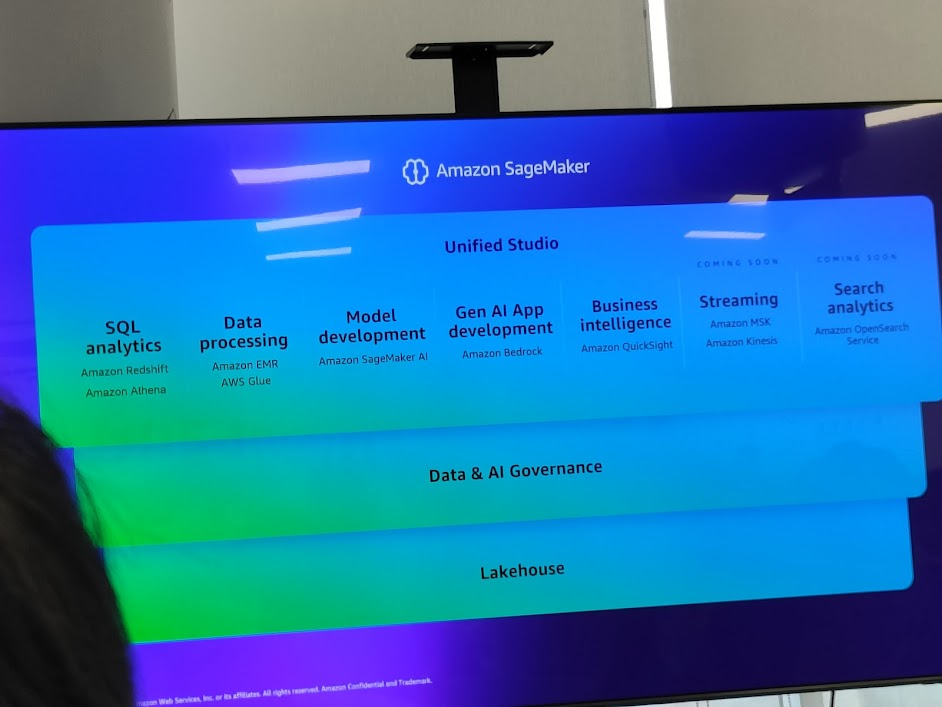
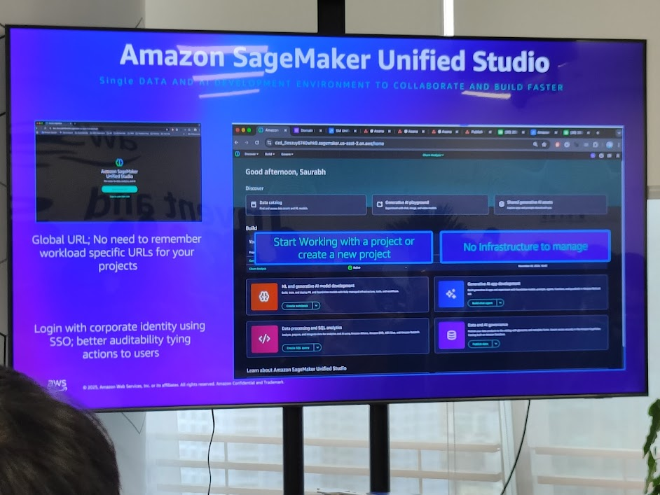

## 1. Overview of SageMaker Unified Studio

Amazon SageMaker Unified Studio is the **only unified development environment** for data, AI, and GenAI applications. It helps businesses reduce complexity, accelerate development, and deploy AI at scale.



### Key components in Unified Studio:

* **SQL Analytics**: Amazon Redshift, Amazon Athena.
* **Data Processing**: Amazon EMR, AWS Glue.
* **Model Development**: Amazon SageMaker AI.
* **GenAI App Development**: Amazon Bedrock.
* **Business Intelligence**: Amazon QuickSight.
* **Streaming**: Amazon MSK, Amazon Kinesis.
* **Search Analytics**: Amazon OpenSearch (coming soon).

```cli
[ Unified Studio ]
   |-- SQL Analytics   -> Redshift, Athena
   |-- Data Processing -> EMR, Glue
   |-- Model Dev       -> SageMaker AI
   |-- GenAI App Dev   -> Bedrock
   |-- BI              -> QuickSight
   |-- Streaming       -> MSK, Kinesis
   |-- Search          -> OpenSearch (soon)
```

---

## 2. SageMaker Unified Studio – Interface



* **Global URL**: No need to remember separate URLs for each workload.
* **SSO Login**: Log in with corporate identity → increased auditability.
* **No infrastructure management**: Focus on projects instead of server setup.

👉 Unified Studio = **one-stop shop** for the entire AI lifecycle, from data preparation → training → deployment.

---

## 3. Collaboration and Accelerated Development


* **Train & deploy AI models**: Amazon SageMaker AI.
* **Prepare & integrate data**: Amazon EMR.
* **Build custom GenAI applications**: Amazon Bedrock IDE (preview).
* **Query data with SQL**: Amazon Redshift.

```cli
[ EMR ] -- Data Prep --> [ SageMaker AI ] -- Train/Deploy --> [ Bedrock IDE ] -- GenAI App --> [ Redshift ] -- Query --> BI
```

---

## 4. SageMaker Lakehouse


Lakehouse = combination of **Data Lake (S3)** + **Data Warehouse (Redshift)** → a single platform for storage and analytics.

* **Amazon S3**: the best place to run data lakes.
* **Amazon Redshift**: petabyte-scale data warehouse.
* **Multi-source integration**: Aurora, RDS, DynamoDB, MySQL, Redis, SAP, Google Cloud, Salesforce...

```cli
+-------------+         +----------------+
|   S3 Lake   | <-----> | Redshift DWH   |
+-------------+         +----------------+
       ^                       ^
       |                       |
   (Aurora, RDS, Dynamo, etc.)
```

---

## 5. Apache Iceberg + Zero-ETL


* **Apache Iceberg API**: open standard for reading/writing data.
* **Fine-grained access control**: detailed access management.
* **Zero-ETL integrations**: no complex ETL pipelines, data flows directly from source to Redshift/S3.
* **Federated querying**: multi-source queries with hundreds of AWS Glue connectors.

👉 Reduce latency & ETL operational costs.

---

## 6. Unified Lakehouse Storage Options


* **Redshift Managed Storage**: optimized for large data warehouses.
* **General-purpose S3**: flexible, low-cost storage.
* **S3 Tables**: manage table-formatted data in the lakehouse.

---

## 7. Data & AI Governance


* **SageMaker Catalog**: integrated within Unified Studio.
* **Built on Amazon DataZone**: manage data, models, GenAI, compute.
* **Governance features**:

  * Data quality, data classification.
  * Data & ML lineage.
  * Permissions & subscription workflows.
  * Guardrails, Responsible AI.
  * Cost logging & monitoring.

---

## 8. Quick Start


* **Single URL login (SSO)**.
* **Use pre-built templates** to quickly create projects.
* **Integrated notebooks**: Bedrock IDE, SQL editor, Jupyter notebooks.

👉 Helps developers avoid being blocked by infrastructure setup.

---

## 9. Strategic Significance

* Unified Studio transforms AWS into the **central IDE for AI + Analytics**.
* Lakehouse + Zero-ETL = minimize data pipeline complexity, expand real-time analytics capabilities.
* Governance + DataZone = ensure compliance and responsible AI.

### Key Insight

* SageMaker is not just an ML service but is becoming the **unified platform for the entire AI lifecycle**.
* Helps businesses go from **data → model → GenAI app** within the same studio.

