**Địa điểm:** Bitexco Financial Tower
**Ngày:** Thứ Bảy, 15 tháng 11 năm 2025  

## Mục tiêu sự kiện
- Cung cấp phần giới thiệu thực tiễn về các năng lực AI/ML/GenAI trên AWS, tập trung vào Amazon Bedrock
- Giúp người tham gia hiểu cách chọn Foundation Models (Claude, Llama, Titan) cho các use case khác nhau
- Hướng dẫn các kỹ thuật prompt engineering (few-shot, structured prompting, reasoning patterns) để cho output tốt hơn
- Giải thích kiến trúc RAG và cách tích hợp Knowledge Base để cải thiện độ chính xác về mặt factual
- Giới thiệu Bedrock Agents cho các workflow nhiều bước và tích hợp tool
- Nhấn mạnh các thực hành an toàn bằng Guardrails cho content filtering và policy control
- Demo một GenAI chatbot end-to-end được xây dựng bằng Amazon Bedrock

## Diễn giả
- **Hoàng Kha** 
- **Hữu Nghị** 
- **Hoàng Anh** 

## Key Highlights

### Chào mừng & Giới thiệu
- **Đăng ký & networking:** Check-in người tham gia, networking, và kết nối với các builders khác
- **Tổng quan workshop:** Đi qua agenda, mục tiêu của workshop nửa ngày, và learning outcomes
- **Hoạt động ice-breaker:** Hoạt động khởi động để thống nhất kỳ vọng và khuyến khích tương tác
- **Giới thiệu diễn giả:** Phiên được dẫn dắt bởi Hoàng Kha, Hữu Nghị, và Hoàng Anh

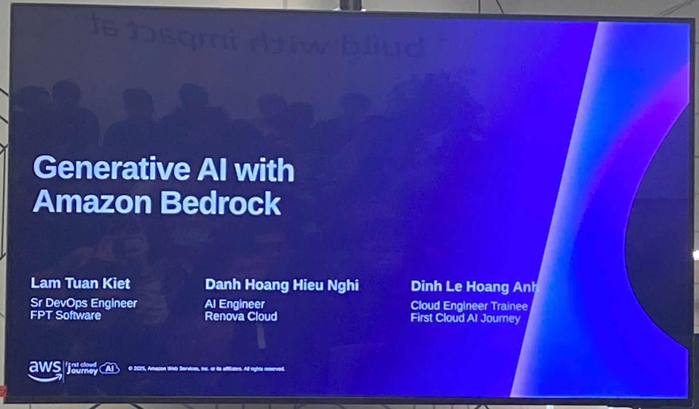
### Generative AI với Amazon Bedrock
- **Prompt Engineering:** Các kỹ thuật để phản hồi tốt hơn, bao gồm structured prompting và few-shot learning
- **Reasoning patterns:** Áp dụng các cách tiếp cận reasoning theo từng bước để tăng tính nhất quán cho các tác vụ phức tạp
- **Guardrails:** Safety controls, policy enforcement, và content filtering cho các ứng dụng GenAI có trách nhiệm
- **Live Demo:** Xây dựng Generative AI chatbot bằng Amazon Bedrock (walkthrough end-to-end)

- **Foundation Models (FM):** Claude, Llama, Titan — so sánh và hướng dẫn lựa chọn theo nhu cầu use case

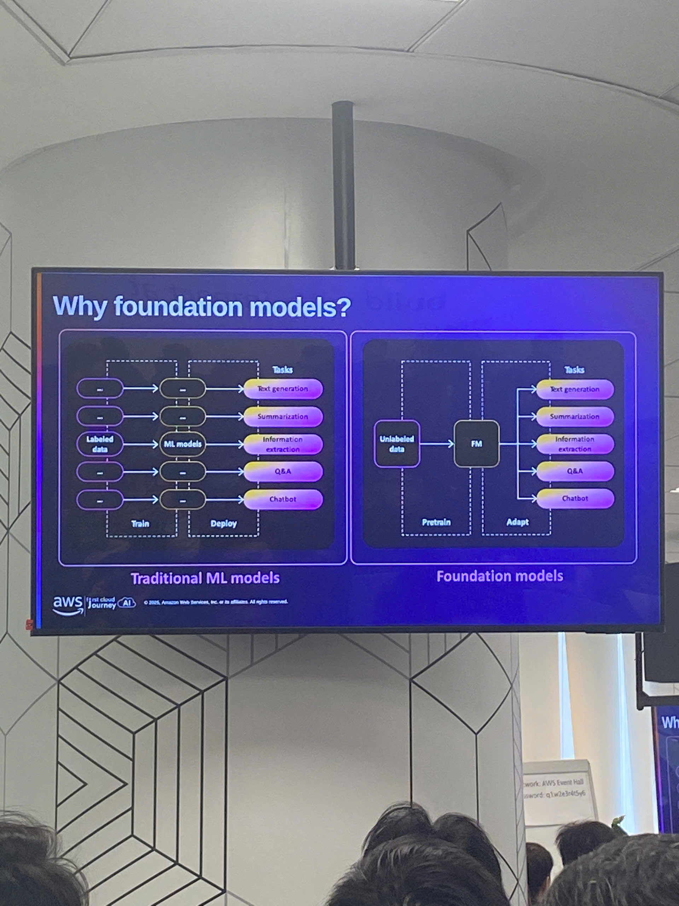

**Traditional ML models:** Dữ liệu gán nhãn → train → triển khai từng model riêng cho mỗi tác vụ (text generation, summarization, information extraction, Q&A, chatbot).  
**Foundation models:** Dữ liệu chưa gán nhãn → pretrain FM → tinh chỉnh/adapter cho nhiều tác vụ (text generation, summarization, information extraction, Q&A, chatbot).

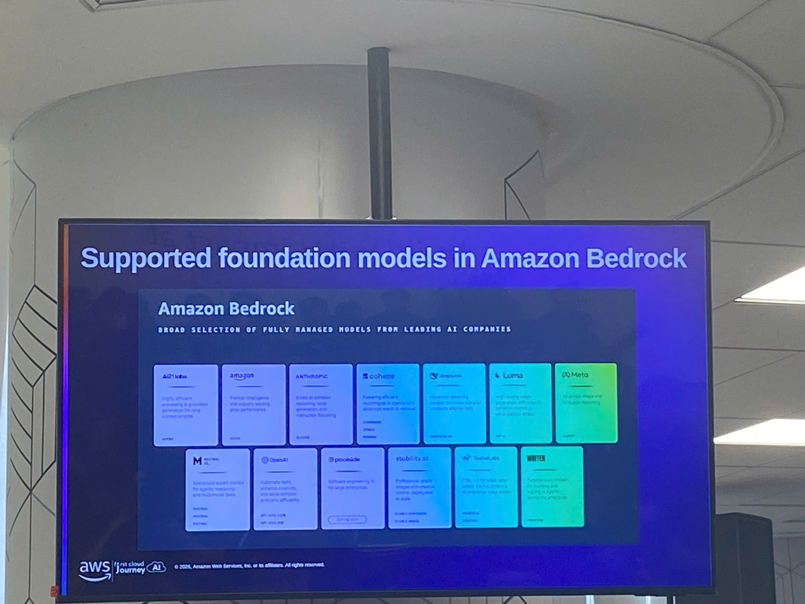

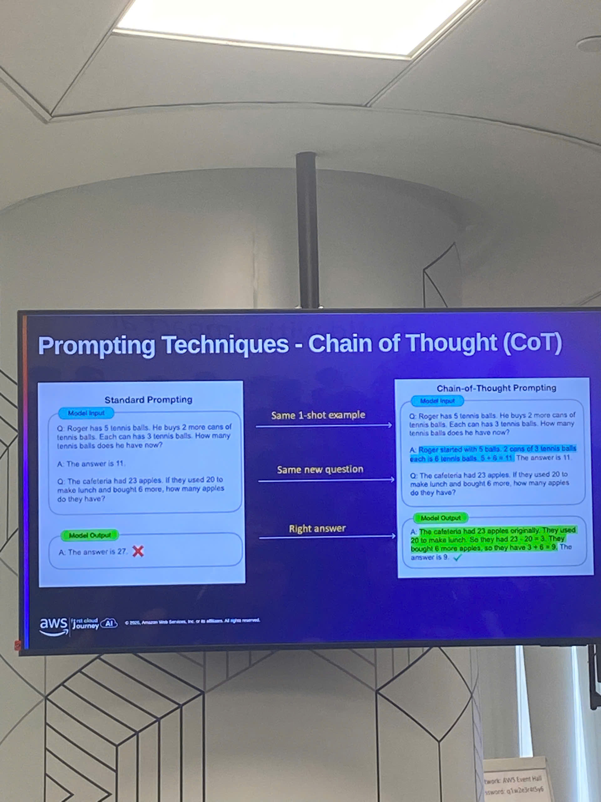

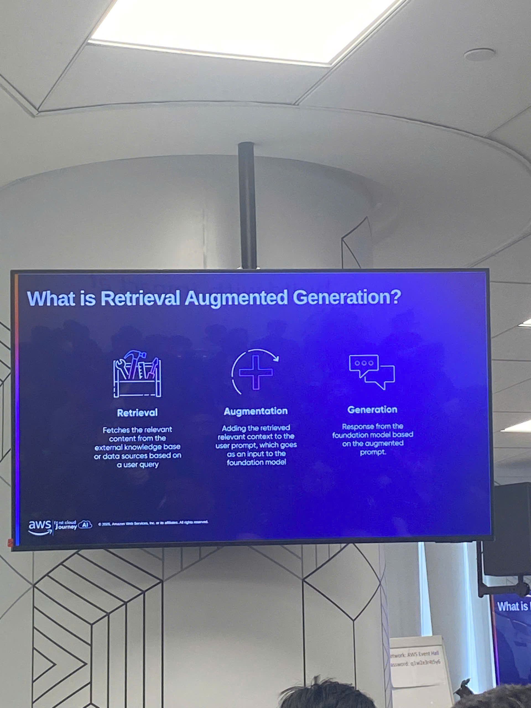

- **RAG (Retrieval-Augmented Generation):** Tổng quan kiến trúc và tích hợp Knowledge Base để ground câu trả lời

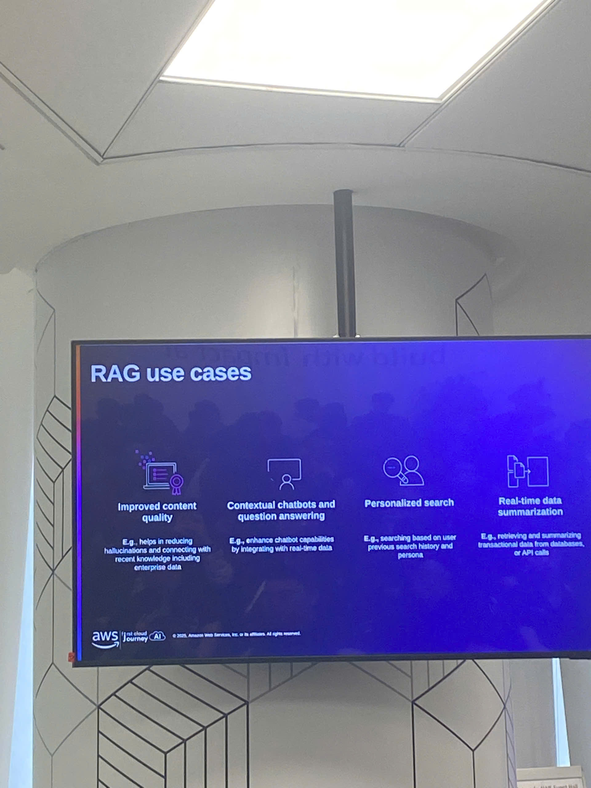

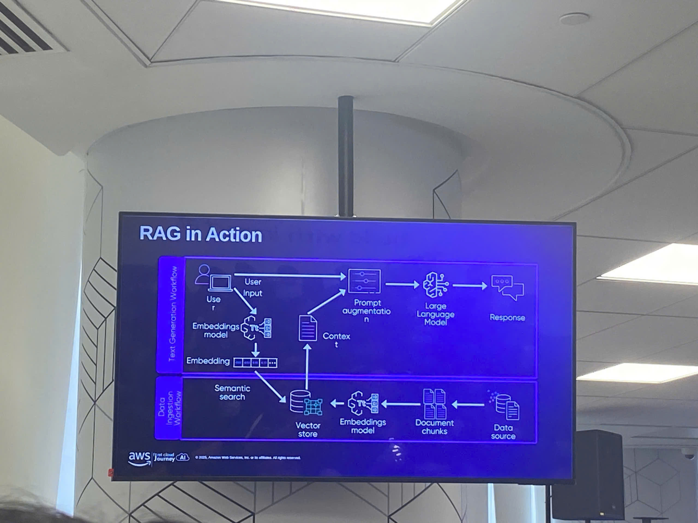

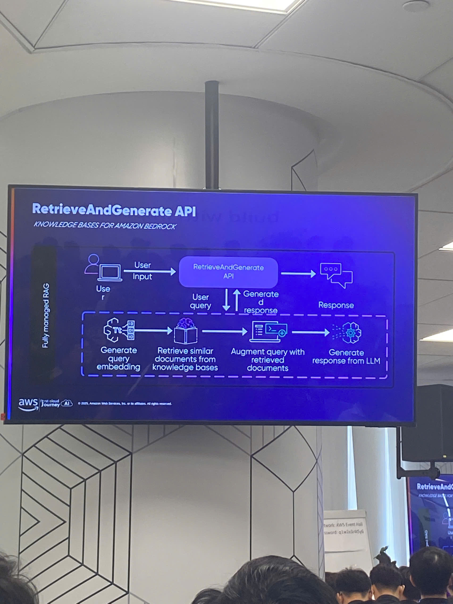

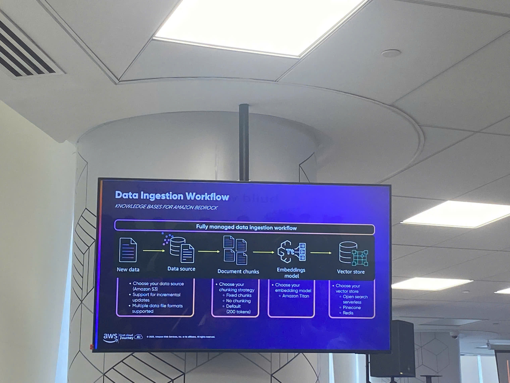

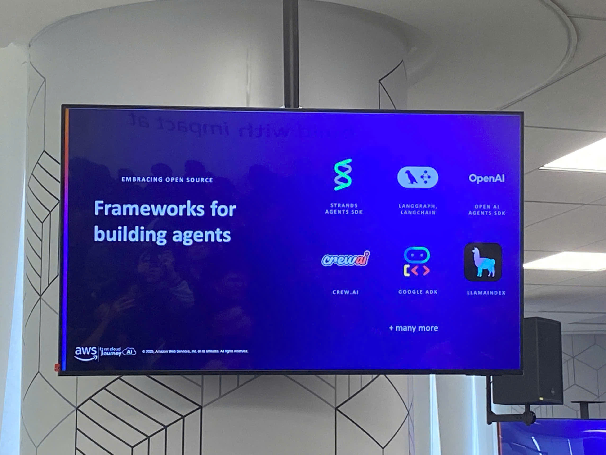

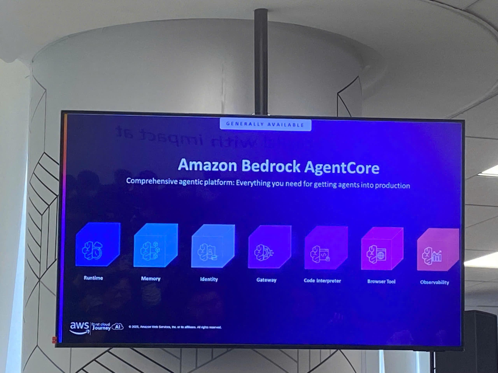

## Key Takeaways

### Design Mindset
- **Use-case first:** Bắt đầu từ bài toán (chatbot, Q&A, automation) rồi chọn đúng model và kiến trúc
- **Grounding matters:** Với các use case enterprise/knowledge-heavy, độ chính xác phụ thuộc vào retrieval + context, không phải “prompt dài hơn”
- **Safety by default:** GenAI có trách nhiệm cần guardrails và policy controls ngay từ đầu, không phải thêm sau như một “afterthought”

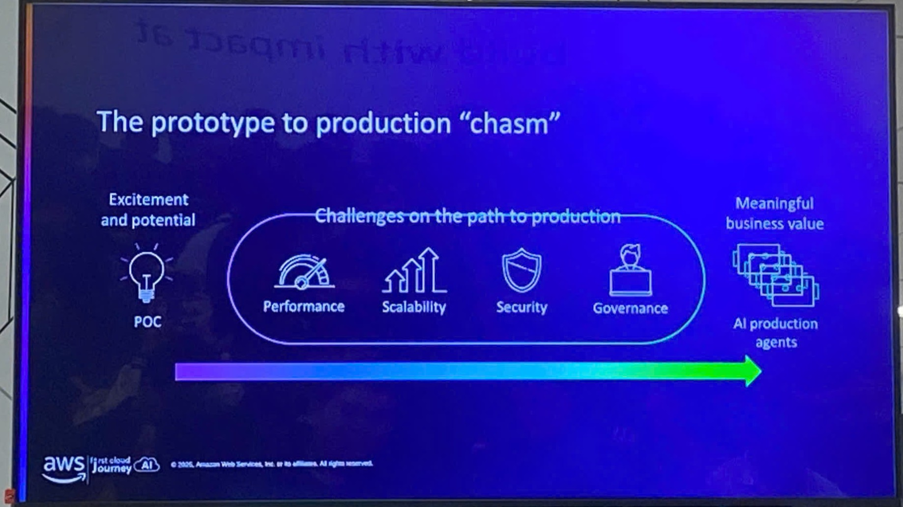

### Technical Architecture
- **Model selection:** Chọn model dựa trên cost, latency, quality, và mức độ phù hợp với loại tác vụ (chat, reasoning, summarization)
- **Prompt engineering:** Dùng structured prompts và examples (few-shot) để giảm mơ hồ và ổn định output
- **RAG workflow:** Retrieve tài liệu liên quan → inject context → generate câu trả lời → (tuỳ chọn) cite sources / log trace
- **Agents & tools:** Agents cho phép thực thi nhiều bước với tools (APIs, search, data lookup) để automation thực sự
- **Guardrails controls:** Lọc nội dung không an toàn, enforce policies, và giảm rủi ro trong production GenAI apps

### Applying to Work
- **Prototype một Bedrock chatbot:** Bắt đầu với knowledge base phạm vi nhỏ (FAQs/docs) và đo chất lượng câu trả lời
- **Tạo prompt library:** Chuẩn hoá prompts/templates cho các tác vụ phổ biến (summarize, classify, extract, Q&A)
- **Thêm RAG để tăng độ tin cậy:** Chuyển từ “prompt-only” sang RAG khi độ chính xác và tính mới của knowledge quan trọng
- **Dùng agents có chọn lọc:** Áp dụng Bedrock Agents khi workflow cần nhiều bước và tool calls
- **Triển khai guardrails:** Định nghĩa policies, monitor outputs, và log prompts/responses để continuous improvement

## Trải nghiệm sự kiện
Tham dự “AI/ML/GenAI on AWS” mang lại góc nhìn hands-on về cách Amazon Bedrock có thể được dùng để xây dựng các ứng dụng GenAI sẵn sàng cho production. Cấu trúc workshop giúp dễ dàng đi từ nền tảng (chọn model và prompting) đến các pattern nâng cao như RAG, Agents, và Guardrails. Live demo giúp kết nối các khái niệm thành một chatbot workflow end-to-end có thể tuỳ biến cho các use case tri thức nội bộ thực tế.

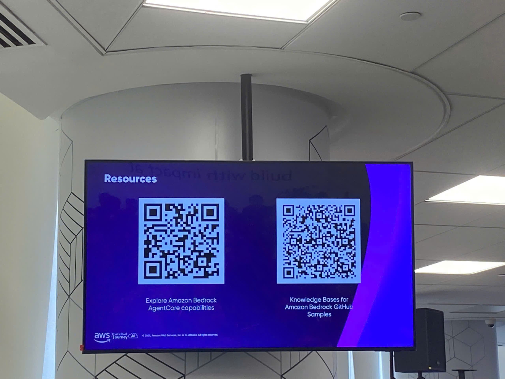
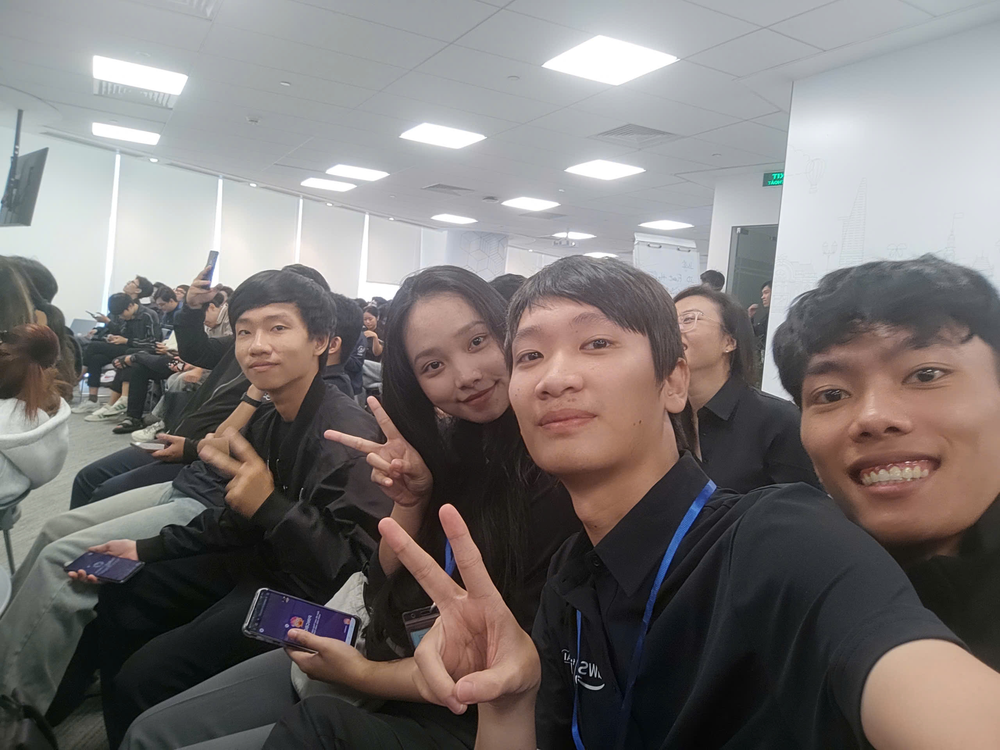
