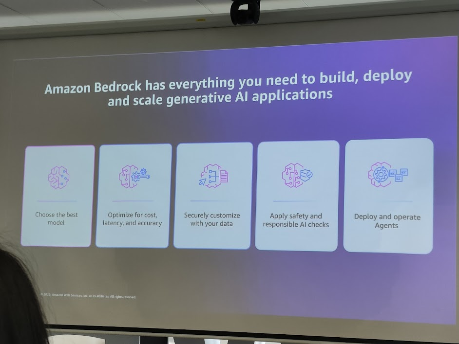
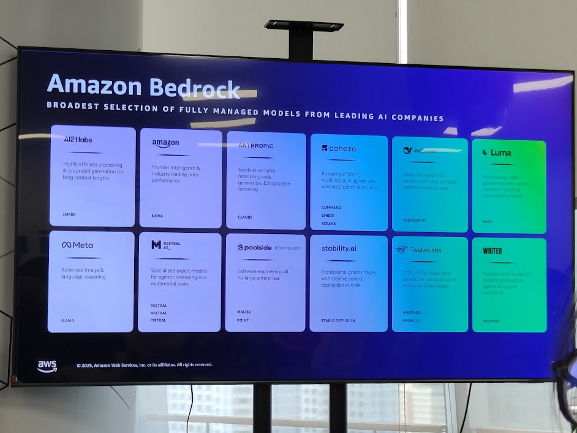
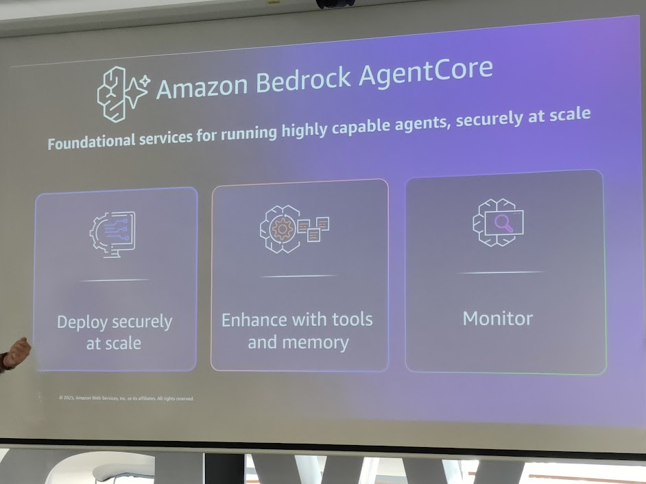

## 1. Giới thiệu Amazon Bedrock

Amazon Bedrock cung cấp nền tảng toàn diện để **xây dựng, triển khai và mở rộng ứng dụng Generative AI**.
Điểm mạnh: không cần quản lý hạ tầng, tích hợp nhiều mô hình hàng đầu và bảo mật theo chuẩn AWS.



### Các năng lực chính:

* **Choose the best model**: Tích hợp nhiều mô hình từ các nhà cung cấp khác nhau.
* **Optimize for cost, latency, and accuracy**: Tối ưu chi phí và hiệu suất.
* **Securely customize with your data**: Cá nhân hóa với dữ liệu riêng của doanh nghiệp.
* **Apply safety and responsible AI checks**: Kiểm soát trách nhiệm và an toàn AI.
* **Deploy and operate Agents**: Triển khai AI Agent trên nền tảng Bedrock.

```cli
+-------------------+   +-------------------+   +-------------------+
|  Model Selection  |-->|  Optimization     |-->|  Customization    |
+-------------------+   +-------------------+   +-------------------+
                               |
                               v
+-------------------+   +-------------------+
| Responsible AI    |-->| Agent Deployment |
+-------------------+   +-------------------+
```

---

## 2. Broadest Model Selection

Bedrock tích hợp **đa dạng mô hình Fully Managed** từ các công ty AI hàng đầu:



* **AI21 Labs**: JAMBA – xử lý hiệu quả, ngữ cảnh dài.
* **Amazon**: NOVA – Frontier intelligence, hiệu năng vượt trội.
* **Anthropic**: Claude – mạnh về reasoning, code generation.
* **Cohere**: Command R – multilingual, search & retrieval.
* **Meta**: LLaMA – image & language reasoning.
* **Mistral, Kestrel**: expert models.
* **Stability AI**: Stable Diffusion – image generation.
* **TwelveLabs**: video AI (Marengo, Pegasus).
* **Writer**: personalized enterprise writing.
* **Luma**: high-quality video AI.
* **Poolside (coming soon)**: enterprise-scale software engineering AI.

👉 Bedrock = **“model marketplace”** fully managed trong hệ sinh thái AWS.

```cli
[ AI21 ]   [ Amazon ]   [ Anthropic ]   [ Cohere ]
[ Meta ]   [ Mistral ]  [ Stability ]   [ TwelveLabs ]
[ Writer ] [ Luma ]     [ Poolside ]    [ Kestrel ]
```

---

## 3. Amazon Bedrock AgentCore

AgentCore là **dịch vụ nền tảng** cho việc triển khai AI Agents **an toàn và ở quy mô lớn**.



### Các năng lực chính:

* **Deploy securely at scale**: Triển khai trên hạ tầng cloud AWS.
* **Enhance with tools and memory**: Kết nối với API, DB, công cụ ngoài và tích hợp memory.
* **Monitor**: Theo dõi & quan sát agent trong môi trường production.

```cli
+-------------------+       +-------------------+       +-------------------+
|   Deployment      | ----> |  Tools + Memory   | ----> |     Monitoring    |
| Secure & Scalable |       | Integration       |       | Observability     |
+-------------------+       +-------------------+       +-------------------+
```

---

## 4. Ý nghĩa chiến lược

* **Bedrock** = hạ tầng AI trung lập, kết nối mô hình đa dạng mà không lock-in.
* **AgentCore** = nền tảng vận hành AI Agents ở quy mô enterprise.
* Giúp doanh nghiệp **chuyển từ POC → production** trong AI nhanh chóng và an toàn.

👉 Đây là bước quan trọng để Việt Nam & khu vực **ứng dụng AI Agent ở mức doanh nghiệp** thay vì chỉ thử nghiệm.

---

## 5. Insight chính cho học liệu Notion

* **Bedrock = trung tâm mô hình + công cụ** để phát triển AI ứng dụng.
* **AgentCore = “runtime OS” cho AI Agent** ở quy mô lớn.
* Tạo ra **ecosystem AI trên AWS** cho cả startup lẫn enterprise.
