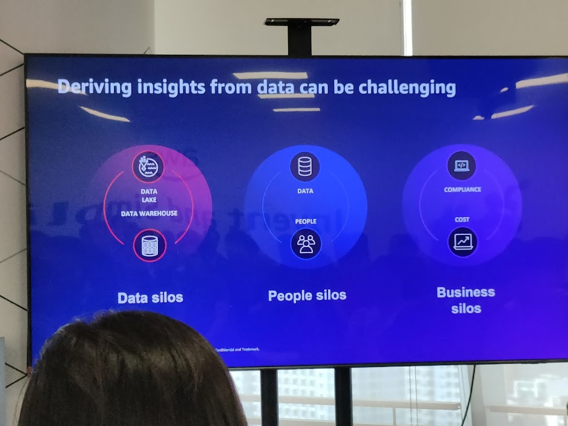
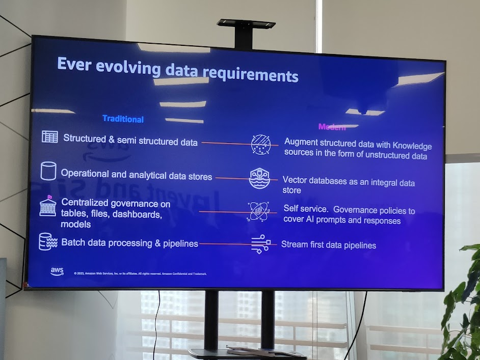
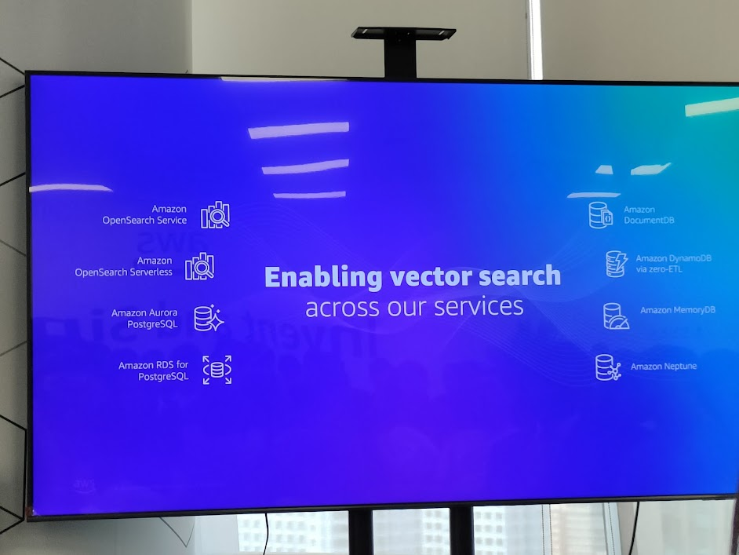

## 1. Challenges from Data Silos

*[Placeholder: Slide - Deriving insights from data can be challenging]*


Organizations often hit blockers because data is **split across isolated silos**:

* **Data silos**: data lakes and data warehouses run independently and are hard to blend.
* **People silos**: data lives inside different functions with little collaboration.
* **Business silos**: compliance, cost, and governance constraints slow sharing.

-> Insights get fragmented, innovation slows, and AI adoption stalls.

```cli
Data Lake + DW   ->   Data silo
Data Owners      ->   People silo
Compliance/Cost  ->   Business silo
```

---

## 2. Evolution of Data Requirements

*[Placeholder: Slide - Ever evolving data requirements]*


### Traditional

* Focused on **structured and semi-structured data**.
* Driven by **batch pipelines**.
* Stored in **operational and analytical systems**.
* Governance centered on **tables, files, and dashboards**.

### Modern

* **Augments structured data** with unstructured sources (documents, media, knowledge).
* **Vector databases** become core for AI workloads.
* **Self-service governance**: policies extend to AI prompts and responses.
* **Stream-first pipelines** replace legacy batch to power real-time AI and analytics.

```cli
Traditional -> Structured data, batch, centralized governance
Modern     -> Vector DB, mixed data, stream-first
```

-> Data now must be **flexible, diverse**, and **AI-ready**.

---

## 3. End-to-End Data Strategy

*[Placeholder: Slide - End-to-end data strategy]*


A complete **end-to-end data strategy** includes:

* **Producers**: create and share data, choose the right tools, embrace self-service.
* **Foundations**: standardize governance, auditing, discovery, and permissions.
* **Consumers**: multi-persona, self-service, easy access across many use cases.

-> Shift the mindset from a *single-purpose stack* -> *a unified shared platform*.

```cli
[ Producers ] -> [ Foundations ] -> [ Consumers ]
Build/Share     Catalog/Govern     Use cases, BI, AI
```

---

## 4. Metadata at the Center

*[Placeholder: Slide - Metadata centric pipeline]*


When metadata sits at the **heart of the data ecosystem**:

* **Data sources (structured + unstructured)** get standardized and enriched.
* Metadata unlocks: find, share, understand, access, act, and monitor.
* This powers **analytics and AI** such as:

  * GenAI / RAG.
  * Forecasting and classification.
  * BI and decision intelligence.
  * Graph analytics and anomaly detection.

```cli
Data Sources -> Prep/Enrich -> Metadata -> Analytics/AI
```

-> Metadata is no longer just a catalog; it becomes the **orchestration layer for AI and analytics**.

---

## 5. Relational & Purpose-built Databases

*[Placeholder: Slide - Complete set of relational and purpose-built databases]*


AWS offers **purpose-built databases** for every workload:

* **Relational**: RDS, Aurora (traditional OLTP and OLAP).
* **Key-Value**: DynamoDB.
* **Document**: DocumentDB.
* **Graph**: Neptune.
* **Caching**: ElastiCache.
* **Time-series**: Timestream.
* **Ledger**: QLDB.
* **Wide column**: Keyspaces.
* **Memory**: MemoryDB for Redis.

-> Embrace **polyglot persistence** instead of one-size-fits-all.

---

## 6. Why one-size-fits-all does not work

*[Placeholder: Slide - Developers want the right datastores]*


A single relational database cannot cover every demand:

* **Performance issues** as datasets grow.
* **Lack of scalability** for surging workloads.
* **Lack of flexibility**: developers are boxed in.
* **Cannot integrate every data type** (images, vectors, graphs, etc.).

-> Developers need datastores matched to the **unique traits of each application**.

```cli
Performance low   Scalability low
Flexibility low   Integration low
```

---

## 7. Enabling Vector Search

*[Placeholder: Slide - Enabling vector search across services]*


AWS has woven Vector Search **across multiple services**:

* OpenSearch Service, OpenSearch Serverless.
* Aurora PostgreSQL, RDS for PostgreSQL.
* DocumentDB, DynamoDB (zero-ETL).
* MemoryDB, Neptune.

-> Vector search is the **AI-native infrastructure layer** that powers GenAI and RAG.

```cli
OpenSearch + AuroraPG + RDS -> Vector Search
DynamoDB + MemoryDB + Neptune -> Vector Search
```

---

## 8. AWS Analytics Stack

*[Placeholder: Slide - Comprehensive set of analytics services]*


The AWS end-to-end analytics toolkit:

* **Amazon Athena**: interactive, serverless querying.
* **Amazon EMR**: large-scale data processing.
* **Amazon Kinesis / MSK / Flink**: real-time analytics.
* **Amazon Redshift**: data warehousing with serverless options.
* **AWS Glue**: data integration and ETL.
* **Amazon QuickSight**: business intelligence.
* **Amazon OpenSearch**: operational analytics.

-> Covers the journey from ingest -> transform -> analyze -> visualize.

---

## 9. Key Insights for the Notion materials

* **Data silos** are the top blocker for AI adoption -> build a unified data foundation.
* **Metadata plus vector databases** unlock GenAI and RAG experiences.
* AWS supplies the full stack: diverse databases + analytics services + governance.
* Organizations should practice **polyglot persistence** to match datastore to workload.

-> This is how AWS delivers **modern data infrastructure** for AI and analytics workloads.

