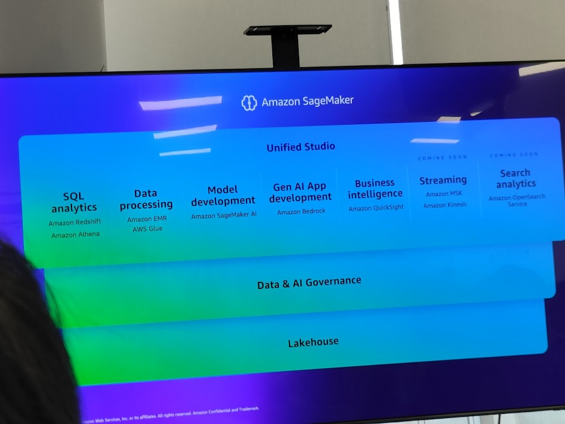
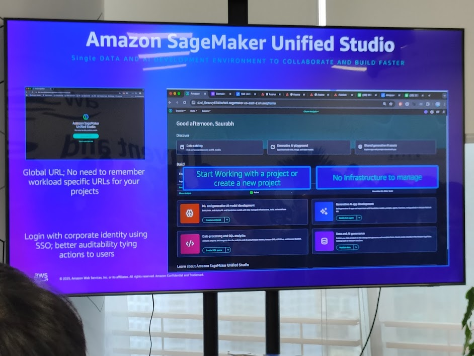
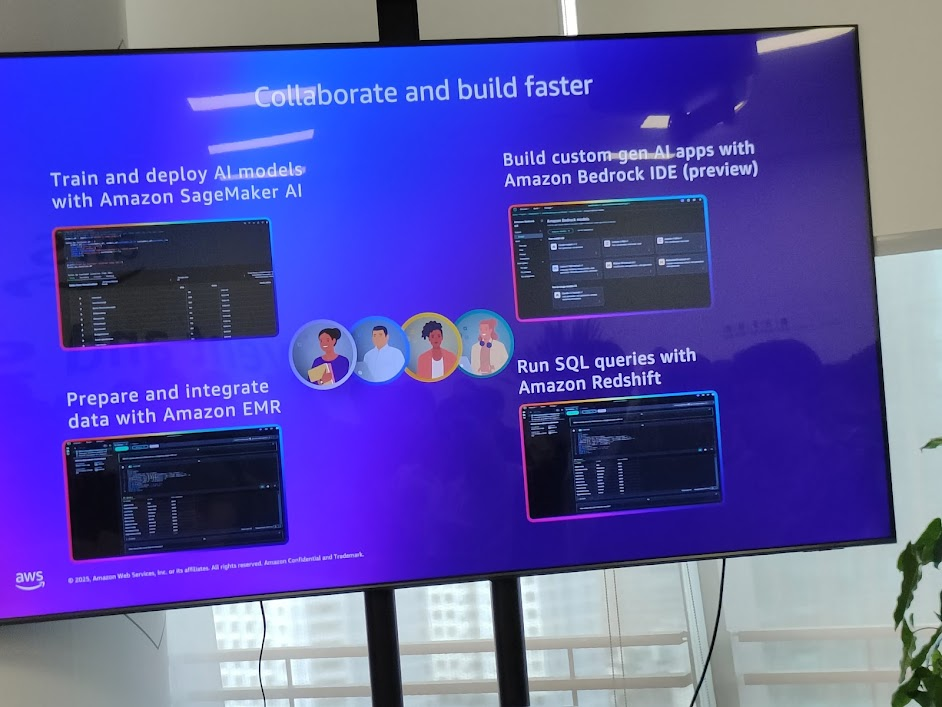
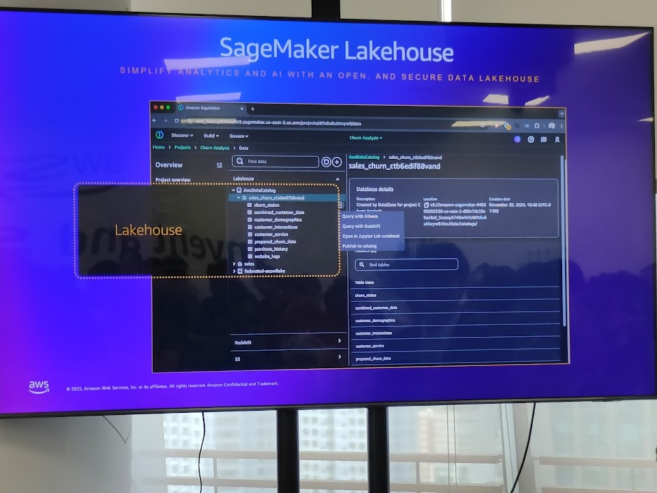
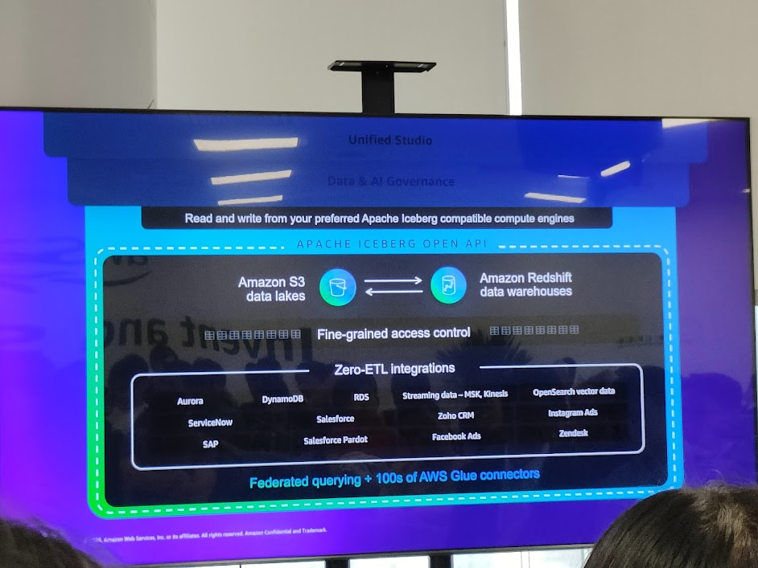
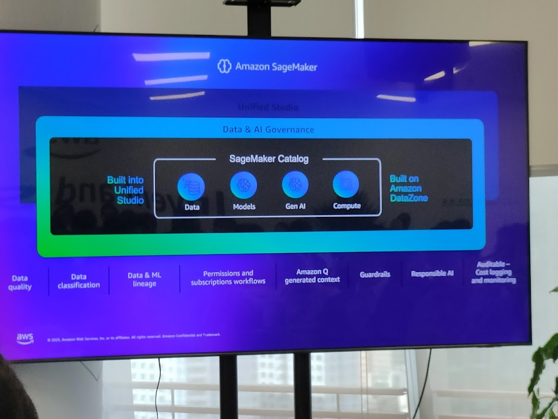
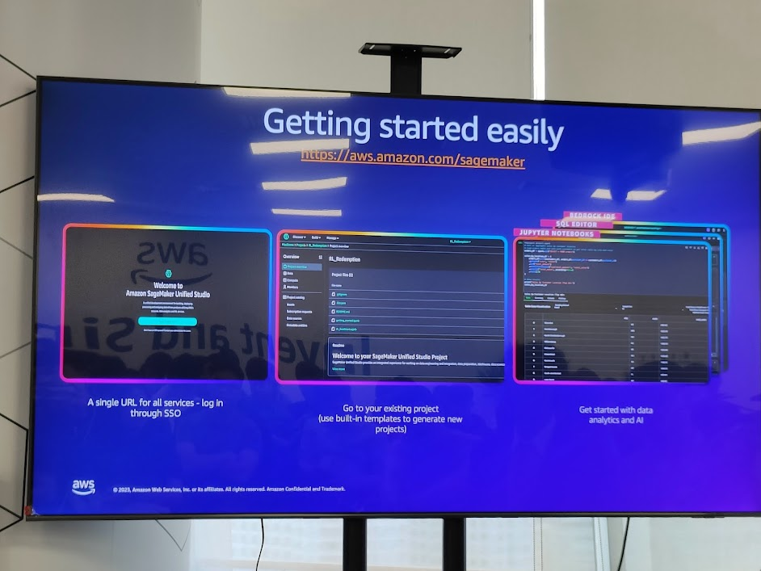

## 1. Tổng quan SageMaker Unified Studio

Amazon SageMaker Unified Studio là môi trường phát triển **duy nhất và hợp nhất** cho dữ liệu, AI, và ứng dụng GenAI. Nó giúp doanh nghiệp giảm độ phức tạp, tăng tốc phát triển và triển khai AI ở quy mô lớn.

<!-- 📷 *[Placeholder: Slide – Unified Studio Overview]* -->


### Thành phần chính trong Unified Studio:

* **SQL Analytics**: Amazon Redshift, Amazon Athena.
* **Data Processing**: Amazon EMR, AWS Glue.
* **Model Development**: Amazon SageMaker AI.
* **GenAI App Development**: Amazon Bedrock.
* **Business Intelligence**: Amazon QuickSight.
* **Streaming**: Amazon MSK, Amazon Kinesis.
* **Search Analytics**: Amazon OpenSearch (coming soon).

```cli
[ Unified Studio ]
   |-- SQL Analytics   -> Redshift, Athena
   |-- Data Processing -> EMR, Glue
   |-- Model Dev       -> SageMaker AI
   |-- GenAI App Dev   -> Bedrock
   |-- BI              -> QuickSight
   |-- Streaming       -> MSK, Kinesis
   |-- Search          -> OpenSearch (soon)
```

---

## 2. SageMaker Unified Studio – Giao diện

<!-- 📷 *[Placeholder: Slide – Unified Studio UI]* -->


* **Global URL**: Không cần nhớ URL riêng cho từng workload.
* **SSO Login**: Đăng nhập bằng corporate identity → tăng auditability.
* **Không cần quản lý hạ tầng**: Tập trung vào project thay vì server setup.

👉 Unified Studio = **một cửa** cho toàn bộ vòng đời AI, từ chuẩn bị dữ liệu → huấn luyện → triển khai.

---

## 3. Hợp tác và tăng tốc phát triển

<!-- 📷 *[Placeholder: Slide – Collaborate & Build Faster]* -->


* **Huấn luyện & triển khai AI models**: Amazon SageMaker AI.
* **Chuẩn bị & tích hợp dữ liệu**: Amazon EMR.
* **Xây dựng ứng dụng GenAI tuỳ chỉnh**: Amazon Bedrock IDE (preview).
* **Query dữ liệu bằng SQL**: Amazon Redshift.

```cli
[ EMR ] -- Data Prep --> [ SageMaker AI ] -- Train/Deploy --> [ Bedrock IDE ] -- GenAI App --> [ Redshift ] -- Query --> BI
```

---

## 4. SageMaker Lakehouse

<!-- 📷 *[Placeholder: Slide – SageMaker Lakehouse]* -->


Lakehouse = kết hợp **Data Lake (S3)** + **Data Warehouse (Redshift)** → một nền tảng duy nhất cho lưu trữ và phân tích.

* **Amazon S3**: nơi tốt nhất để chạy data lakes.
* **Amazon Redshift**: kho dữ liệu petabyte-scale.
* **Tích hợp đa nguồn**: Aurora, RDS, DynamoDB, MySQL, Redis, SAP, Google Cloud, Salesforce...

```cli
+-------------+         +----------------+
|   S3 Lake   | <-----> | Redshift DWH   |
+-------------+         +----------------+
       ^                       ^
       |                       |
   (Aurora, RDS, Dynamo, etc.)
```

---

## 5. Apache Iceberg + Zero-ETL

<!-- 📷 *[Placeholder: Slide – Zero-ETL Architecture]* -->


* **Apache Iceberg API**: chuẩn mở cho đọc/ghi dữ liệu.
* **Fine-grained access control**: kiểm soát truy cập chi tiết.
* **Zero-ETL integrations**: không cần pipeline ETL phức tạp, dữ liệu chảy trực tiếp từ nguồn đến Redshift/S3.
* **Federated querying**: query đa nguồn với hàng trăm AWS Glue connectors.

👉 Giảm latency & chi phí vận hành ETL.

---

## 6. Unified Lakehouse Storage Options

<!-- 📷 *[Placeholder: Slide – Storage Options]* -->


* **Redshift Managed Storage**: tối ưu cho kho dữ liệu lớn.
* **General-purpose S3**: lưu trữ linh hoạt, chi phí thấp.
* **S3 Tables**: quản lý dữ liệu dạng bảng trong lakehouse.

---

## 7. Data & AI Governance

<!-- 📷 *[Placeholder: Slide – Data Governance]* -->


* **SageMaker Catalog**: tích hợp trong Unified Studio.
* **Built on Amazon DataZone**: quản lý dữ liệu, models, GenAI, compute.
* **Governance features**:

  * Data quality, data classification.
  * Data & ML lineage.
  * Permissions & subscription workflows.
  * Guardrails, Responsible AI.
  * Cost logging & monitoring.

---

## 8. Bắt đầu nhanh chóng

<!-- 📷 *[Placeholder: Slide – Getting Started Easily]* -->


* **Single URL login (SSO)**.
* **Dùng templates có sẵn** để tạo project nhanh.
* **Notebook tích hợp**: Bedrock IDE, SQL editor, Jupyter notebooks.

👉 Giúp developer không bị chặn bởi setup hạ tầng.

---

## 9. Ý nghĩa chiến lược

* Unified Studio biến AWS thành **IDE trung tâm cho AI + Analytics**.
* Lakehouse + Zero-ETL = giảm thiểu phức tạp data pipeline, mở rộng khả năng phân tích real-time.
* Governance + DataZone = đảm bảo tính tuân thủ và trách nhiệm AI.

### Insight chính

* SageMaker không chỉ là ML service, mà đang trở thành **nền tảng hợp nhất toàn bộ AI lifecycle**.
* Giúp doanh nghiệp đi từ **data → model → app GenAI** trong cùng một studio.
